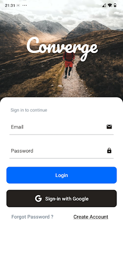

# Converge
Event Management System
<!-- [Final year project] -->

An Android application that has been designed for the users to easily manage and track the events through their smartphones. Users can also chat with other users of the attending event and can explore several other events that are being hosted using the app.

#Tools
1. Oauth2 for Google sign in.
2. Google maps api for implementation of google maps.
3. Stream chat api for the inclusion of chat facility in the application.
